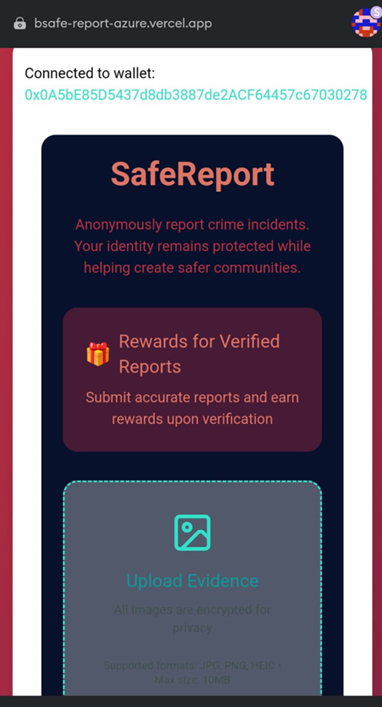
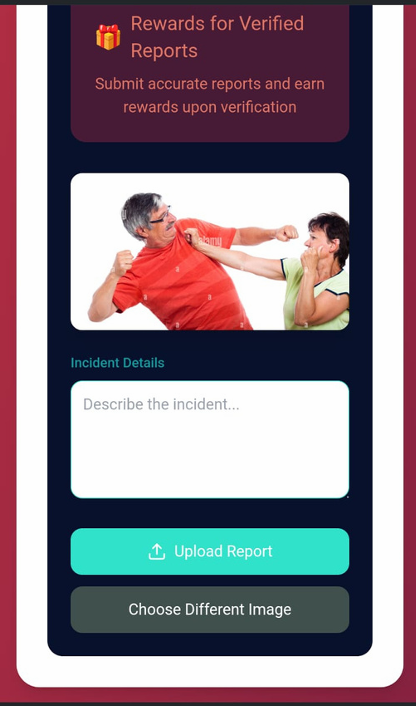

# BSafe - Your Personal Safety Companion


BSafe is a comprehensive personal safety application designed to provide users with immediate access to emergency services, real-time safety information, and location-based safety features.

## Features

### 🆘 Emergency SOS
- One-tap emergency activation
- Direct connection to emergency services (911)
- Location sharing with emergency contacts
- Confirmation dialog to prevent accidental activation
- Visual feedback with pulsing animation

### 🗺️ Safety Map
- Real-time crime mapping
- Safe route navigation
- Location-based alerts
- Crime hotspot visualization
- Customizable filters for different time frames and crime types

### 👤 Profile Management
- Personal safety score tracking
- Emergency contacts management
- Safety preferences customization
- Activity summary and statistics
- Privacy and security settings

### 📰 Safety Resources
- Latest safety-related news
- Emergency contact numbers
- Safety guidelines and tips
- Real-time crime alerts
- Community safety information

## Technical Features

### Location Services
- Real-time location tracking
- Geofencing for high-risk areas
- Background location monitoring
- Automatic safety checks in risky areas

### Security
- End-to-end encryption
- Secure data storage
- Privacy-focused design
- Regular security updates

## Installation

1. Clone the repository:
```bash
git clone https://github.com/Alan21303/Bsafe.git
```

2. Install dependencies:
```bash
flutter pub get
```

3. Run the app:
```bash
flutter run
```

## Requirements

- Flutter SDK: ^3.6.0
- Dart SDK: ^3.6.0
- Android SDK: API 21+ (Android 5.0 or higher)
- iOS: iOS 11.0 or higher

## Dependencies

Key packages used in this project:
```yaml
dependencies:
  flutter_map: ^6.1.0
  geolocator: ^11.0.0
  firebase_auth: ^4.17.9
  firebase_core: ^2.27.1
  provider: ^6.1.2
  http: ^1.2.0
  url_launcher: ^6.2.5
  permission_handler: ^11.3.0
```

## Configuration

1. Firebase Setup:
   - Create a Firebase project
   - Add your `google-services.json` for Android
   - Add your `GoogleService-Info.plist` for iOS

2. API Keys:
   - Add your Currents API key in `lib/core/providers/news_provider.dart`

3. Permissions:
   - Location permissions
   - Phone call permissions
   - Internet access

## Project Structure

```
lib/
├── core/
│   ├── constants/
│   ├── providers/
│   └── theme/
├── presentation/
│   ├── screens/
│   │   ├── emergency/
│   │   ├── home/
│   │   ├── profile/
│   │   └── resources/
│   └── widgets/
└── main.dart
```

## Key Features Implementation

### Emergency SOS
The SOS feature implements a three-layer safety mechanism:
1. User activation
2. Confirmation dialog
3. Emergency services contact

### Safety Map
Utilizes OpenStreetMap with custom markers for:
- Crime incidents
- Safe zones
- User location
- Emergency services

### Profile System
Implements:
- Safety score calculation
- Emergency contacts management
- Preference settings
- Activity tracking

## Contributing

1. Fork the repository
2. Create your feature branch (`git checkout -b feature/AmazingFeature`)
3. Commit your changes (`git commit -m 'Add some AmazingFeature'`)
4. Push to the branch (`git push origin feature/AmazingFeature`)
5. Open a Pull Request

## License

This project is licensed under the MIT License - see the [LICENSE](LICENSE) file for details.

## Acknowledgments

- OpenStreetMap for map data
- Currents API for news feeds
- Flutter team for the amazing framework
- Contributors and testers


## Screenshots

Here are some screenshots of the app:

  
  
  
  
  
  
  
  


---

Made with ❤️ for community safety
